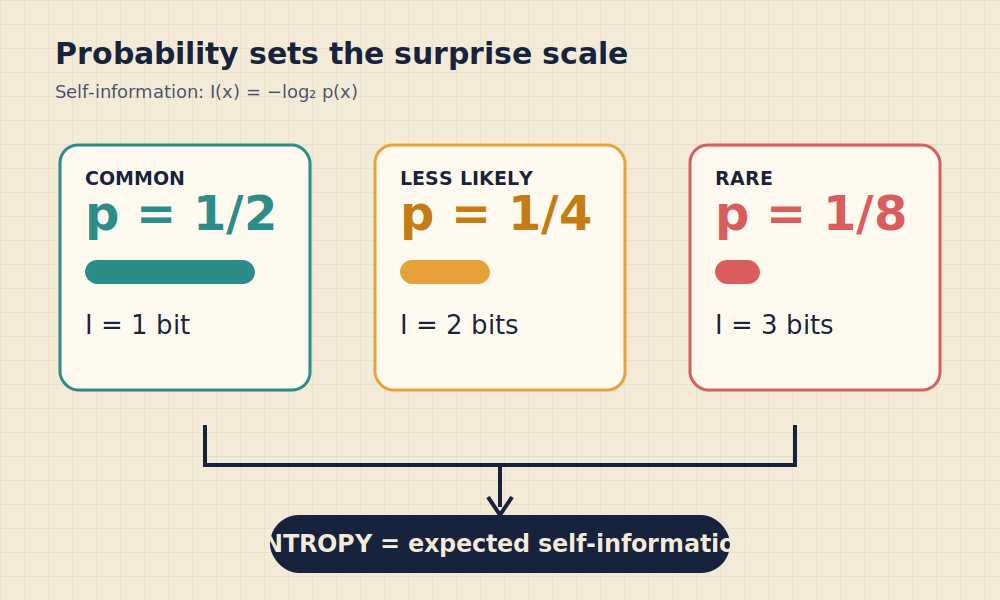
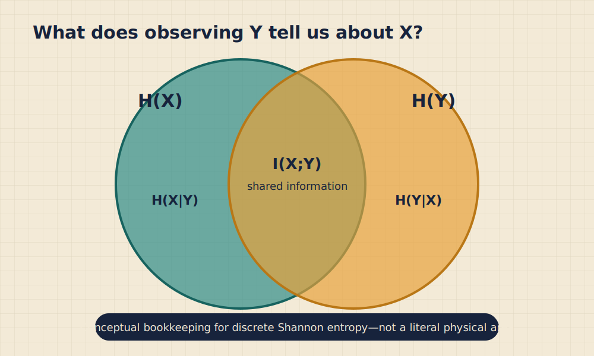
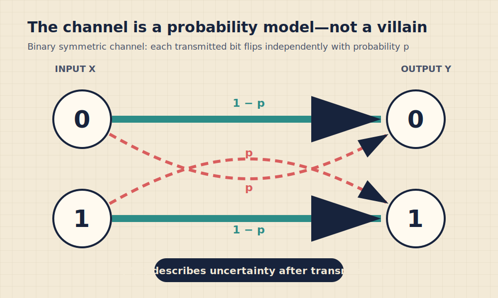
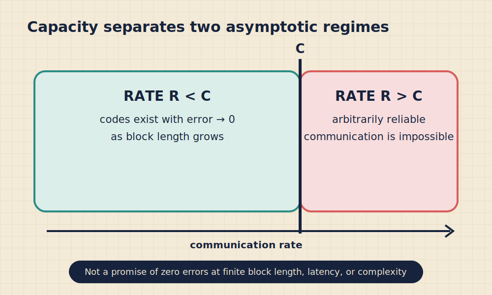

# Chapter 1: Measuring Information—Surprise, Entropy, and Channel Capacity

:::warning
**Demonstration only:** This chapter shows what an AI agent can produce by following Coursewerk. It is not intended for direct use in actual teaching and has not received classroom or subject-matter validation.
:::

:::info
**Reference:** Seven-article, revision-bound English Wikipedia corpus; exact revisions in `metadata/SOURCE_RECORD.json`  
**Audience:** Introductory undergraduate learners across mathematics, computing, engineering, and information science  
**Package license:** CC BY-SA 4.0  
**Scope boundary:** Finite discrete sources and simplified memoryless channels; information quantities are not measures of meaning or value
:::

:::success
**Chapter Learning Objectives**

- **1.1a–b:** Separate statistical information from semantic importance; calculate self-information.
- **1.2a–b:** Calculate and compare entropy for small discrete distributions.
- **1.3a–b:** Relate conditional entropy and mutual information; interpret a channel as $P(Y|X)$.
- **1.4a–b:** Explain capacity and state the noisy-channel theorem with finite-length boundaries.
:::

## Chapter Logic

Suppose a receiver sees a symbol. How much has been learned? The answer depends on what was plausible before the symbol arrived. If one outcome was nearly certain, observing it resolves little uncertainty. If an outcome was rare, observing it is more informative in Shannon's statistical sense. This chapter turns that intuition into a chain: probability → self-information → average uncertainty → shared information → channel capacity → bounded reliability claim.

**Visual description:** Outcomes with probabilities $1/2$, $1/4$, and $1/8$ carry 1, 2, and 3 bits of self-information. Entropy is the probability-weighted average across all possible outcomes, not the value of one card.

:::warning
**Language boundary:** Here, “information” quantifies uncertainty reduction in a probability model. It does not directly measure meaning, truth, usefulness, beauty, urgency, or the number of physical binary devices used to store a message.
:::

## 1.1 Probability Sets the Surprise Scale{{attrs[#blk-surprise11]}}

:::success
**Learning Objectives**

- Explain why less probable outcomes carry greater self-information.
- Calculate self-information in bits and interpret the logarithm base.
:::

For a discrete outcome $x$ with probability $p(x)>0$, its **self-information** is

$$
I(x)=-\log_b p(x).
$$

The logarithm base sets the unit. Base 2 gives **bits**; base $e$ gives **nats**. Three design requirements motivate the logarithm: information should be nonnegative, a less probable outcome should carry more, and independent outcomes should add. If independent outcomes have probabilities $p(x)$ and $p(y)$, then

$$
-\log_2[p(x)p(y)]= -\log_2p(x)-\log_2p(y).
$$

:::: tabs
::: tab Problem
A source emits four symbols with probabilities $1/2$, $1/4$, $1/8$, and $1/8$. Find the self-information of each.
:::
::: tab Work
Use $I(x)=-\log_2p(x)$:

$$
I(1/2)=1,\quad I(1/4)=2,\quad I(1/8)=3\text{ bits}.
$$

The two outcomes with probability $1/8$ each carry 3 bits when observed.
:::
::: tab Boundary
These values do not say that the rare symbols are more meaningful. They say only that each resolves more uncertainty under the stated distribution.
:::
::::

A zero-probability outcome has no finite self-information under the formula. That does not mean a physically observed event can literally deliver infinite usable information. It means the model assigned zero probability to something that occurred, so the model or its support must be reconsidered.

### Physical signals and abstract symbols

The 70-metre antenna at Goldstone is part of a physical communication system. Voltages, electromagnetic fields, amplifiers, timing, and interference matter. Information theory abstracts away many of those details long enough to ask a precise question: given a model for input and output symbols, how much uncertainty can transmission resolve? The abstraction is powerful because the same mathematics can describe many physical carriers, but no abstraction automatically validates the model for a particular link.

*Image credit: NASA/JPL, Goldstone Deep Space Network antenna, U.S. federal government work, public domain, via Wikimedia Commons; used without modification.*

## 1.2 Entropy Is Expected Surprise{{attrs[#blk-entropy12]}}

:::success
**Learning Objectives**

- Calculate Shannon entropy for a finite distribution.
- Predict how concentration or uniformity changes entropy.
:::

For a discrete random variable $X$ with outcomes $x$, **Shannon entropy** is

$$
H(X)=-\sum_x p(x)\log_2p(x)=\mathbb{E}[I(X)].
$$

Entropy is an expectation taken before the outcome is known. Self-information is attached to one possible or observed outcome. Conflating them is like confusing one student's score with the class average.

For a fair coin,

$$
H(X)=-\tfrac12\log_2\tfrac12-\tfrac12\log_2\tfrac12=1\text{ bit}.
$$

For a coin with probabilities $0.75$ and $0.25$,

$$
H(X)=-(0.75\log_2 0.75+0.25\log_2 0.25)\approx0.811\text{ bits}.
$$

The skewed coin is more predictable, so its average uncertainty is lower.

:::: tabs
::: tab Compare
Source A is uniform over four symbols. Source B has probabilities $(1/2,1/4,1/8,1/8)$. Which has greater entropy?
:::
::: tab Work
For A, each symbol has 2 bits of self-information, so $H(A)=2$ bits.

For B,

$$
H(B)=\tfrac12(1)+\tfrac14(2)+\tfrac18(3)+\tfrac18(3)=1.75\text{ bits}.
$$

Source A has greater entropy.
:::
::: tab Generalize
Among distributions on a fixed finite alphabet, entropy is largest for the uniform distribution. “Largest” is conditional on the same available alphabet; adding possible outcomes changes the comparison.
:::
::::

### Entropy is not “disorder” without a model

Informal explanations sometimes replace entropy with “disorder.” That shortcut can hide the object being measured. Information entropy belongs to a random variable and a probability distribution. A sequence that looks visually irregular can have low entropy if a compact rule generated it; a sequence that looks repetitive can be surprising under a different model. Always ask: **entropy of which variable, under which distribution, in which units?**

### Compression connection

Entropy sets an idealized average description-length scale for lossless coding of a source under appropriate assumptions and long blocks. It is not a guarantee that every individual symbol can be represented by a fractional number of physical bits, nor does it specify one practical compressor. Coding across many symbols allows average lengths to approach the entropy bound.

## 1.3 What Does the Output Reveal?{{attrs[#blk-mutual13]}}

:::success
**Learning Objectives**

- Interpret conditional entropy as uncertainty remaining after an observation.
- Relate mutual information to uncertainty reduction without inferring causation.
:::

With two discrete variables $X$ and $Y$, **conditional entropy** $H(X|Y)$ measures the average uncertainty remaining about $X$ after $Y$ is observed. **Mutual information** can be written as

$$
I(X;Y)=H(X)-H(X|Y)=H(Y)-H(Y|X).
$$

It is symmetric: $I(X;Y)=I(Y;X)$. For discrete variables, it is nonnegative and equals zero exactly when the variables are independent.

**Visual description:** The uncertainty in $X$ and $Y$ is drawn as overlapping regions. The overlap $I(X;Y)$ represents shared information; the remaining regions represent $H(X|Y)$ and $H(Y|X)$. The areas are conceptual bookkeeping for discrete Shannon entropy, not physical regions or a universal geometry.

:::: tabs
::: tab Case A
$X$ is a fair bit and $Y=X$ exactly. Find $H(X)$, $H(X|Y)$, and $I(X;Y)$.
:::
::: tab Answer A
$H(X)=1$ bit. Once $Y$ is observed, $X$ is known, so $H(X|Y)=0$. Therefore $I(X;Y)=1$ bit.
:::
::: tab Case B
$X$ and $Y$ are independent fair bits. Find the same quantities.
:::
::: tab Answer B
$H(X)=1$ bit. Observing independent $Y$ leaves all uncertainty about $X$, so $H(X|Y)=1$. Therefore $I(X;Y)=0$.
:::
::::

Mutual information measures statistical dependence, not direction or mechanism. A common cause can make two variables informative about one another. Establishing causation requires a different design and evidence chain.

### A channel is $P(Y|X)$

A **communication channel** is a probabilistic relationship between an input $X$ and output $Y$. A simple **binary symmetric channel** flips each input bit with probability $p$ and preserves it with probability $1-p$, independently under the model.

**Visual description:** Thick teal paths preserve 0 or 1 with probability $1-p$. Dashed coral paths flip the bit with probability $p$. The diagram specifies conditional probabilities; it does not claim that all real channels have independent symmetric errors.

When $X$ is a uniform bit and $0\le p\le1/2$, the binary entropy function

$$
h_2(p)=-p\log_2p-(1-p)\log_2(1-p)
$$

describes uncertainty introduced by the flip. In this symmetric case,

$$
I(X;Y)=1-h_2(p).
$$

At $p=0.1$, $h_2(0.1)\approx0.469$, so $I(X;Y)\approx0.531$ bit per channel use for the uniform input. At $p=1/2$, output and input are independent and the mutual information is zero.

## 1.4 Capacity Is a Boundary, Not a Performance Report{{attrs[#blk-capacity14]}}

:::success
**Learning Objectives**

- Explain why channel capacity maximizes over input distributions.
- State what the noisy-channel coding theorem does and does not promise.
:::

For a discrete memoryless channel, capacity is

$$
C=\max_{p(x)} I(X;Y),
$$

where the maximization ranges over permitted input distributions. A chosen input distribution can deliver less than capacity. For a binary symmetric channel with crossover probability $0\le p\le1/2$, the uniform input achieves

$$
C=1-h_2(p)\quad\text{bits per channel use}.
$$

The unit matters. “Bits per channel use” is not automatically “bits per second”; converting requires a definition of channel use and timing.

**Visual description:** Rates below $C$ lie in an achievable asymptotic region; rates above $C$ lie in an impossible region for arbitrarily reliable communication under the model. A note emphasizes that finite block length, latency, and complexity retain nonzero trade-offs.

### The theorem in calibrated language

The noisy-channel coding theorem supports two linked statements for the modeled class of channels:

1. **Achievability:** for rates below capacity, codes exist whose decoding error probability can be made arbitrarily small as block length grows.
2. **Converse:** rates above capacity cannot sustain arbitrarily small error probability.

The theorem is not a recipe for a practical code. It does not say that every code below capacity works, that error becomes exactly zero at a finite length, or that unmodeled burst errors, drift, synchronization failures, adversaries, hardware faults, and decoder mismatch disappear.

:::: tabs
::: tab Diagnose
A system uses the binary symmetric channel model with $p=0.1$, so $C\approx0.531$ bit/use. A report says, “At rate 0.50, every finite message is guaranteed correct.” What is wrong?
:::
::: tab Repair
Rate 0.50 is below the modeled capacity, so the theorem says that suitable code families can make error probability arbitrarily small as block length grows. It does not guarantee every finite message, every code, or zero error. A defensible report must give the actual code, block length, decoder, measured or bounded error probability, and evidence that the channel model applies.
:::
::::

### Model audit

Before quoting a capacity, ask:

- What are the input and output alphabets?
- Does the channel have memory?
- Are errors symmetric, independent, stationary, or bursty?
- Are input cost or power constraints included?
- What is one channel use?
- Is the decoder matched to the assumed transition probabilities?
- Is the claim asymptotic, bounded, simulated, or experimentally measured?

## Synthesis

The chapter's logic can be compressed into four questions:

1. **Before observing:** what distribution describes the source?
2. **After observing:** how much uncertainty remains?
3. **Across a channel:** which input distribution maximizes what the output reveals?
4. **For a real code:** how far is finite performance from the asymptotic boundary?

Chapter 2 starts at that fourth question. It replaces “codes exist” with visible structure: redundancy, distance, parity checks, syndromes, and decoders.

## Asset and License Record for This Chapter

- `assets/goldstone-antenna.jpg` — NASA/JPL, public domain; used without modification.
- `assets/surprise-entropy.svg` — original accessible diagram by Yu Wang, CC BY-SA 4.0.
- `assets/mutual-information.svg` — original accessible diagram by Yu Wang, CC BY-SA 4.0.
- `assets/noisy-channel.svg` — original accessible diagram by Yu Wang, CC BY-SA 4.0.
- `assets/capacity-boundary.svg` — original accessible diagram by Yu Wang, CC BY-SA 4.0.

**Text adaptation:** Adapted and reorganized from the revision-bound Wikipedia sources named at the beginning of this chapter, by Wikipedia contributors under CC BY-SA 4.0. Exact revisions and retrieval hashes are recorded in `metadata/SOURCE_RECORD.json`.
